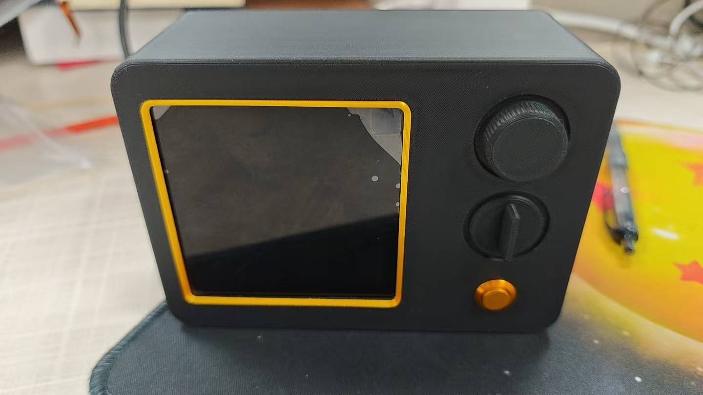
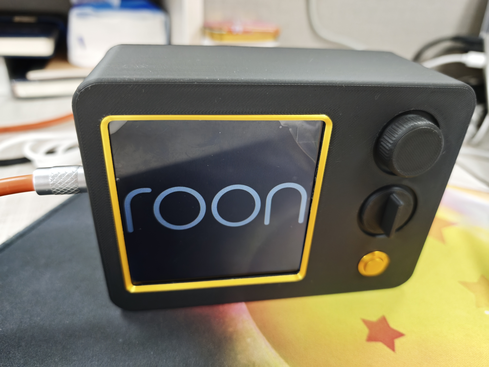
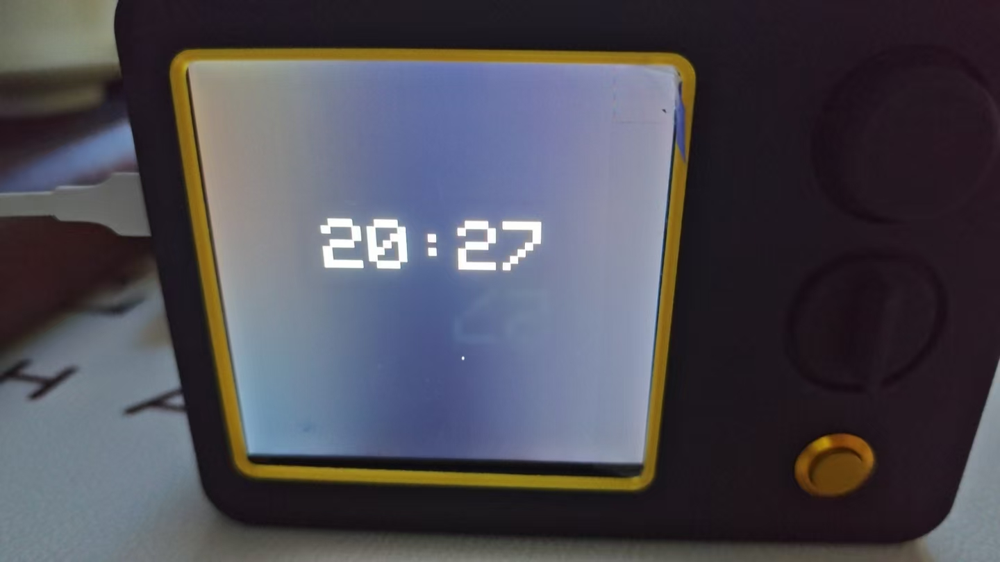
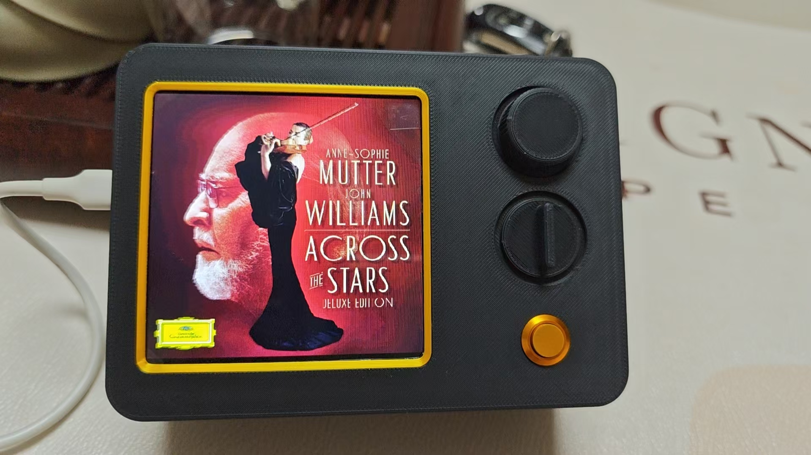
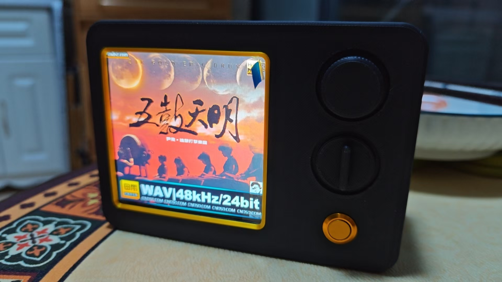

# Roon Cover Display — ROON 桌面专辑封面显示器

基于微雪 ESP32-S3-Touch-LCD-4 (V4 非触摸版) 的 Roon 专辑封面桌面小摆件。连接局域网内的 RoonCoverArt 服务器，在 480×480 屏幕上实时显示当前播放曲目的专辑封面，**空闲时自动切换为 NTP 时钟**。

## 效果

外观
logo
时钟
显示1
显示2

- 上电 → 启动画面 "roon display" → 自动连接 WiFi → 连接 Roon 服务器 → 全屏显示封面
- **切歌 200ms 内检测，1-3s 内显示新封面**（v1 为 30-60s）
- **停止播放 15s 后自动切换为时钟**（大号 HH:MM + 中文 "年月日 周X"）
- 任何曲目开始播放立即返回全屏封面
- 服务器离线/断网自动重连

## 硬件

| 项目 | 参数 |
|------|------|
| 开发板 | 微雪 ESP32-S3-Touch-LCD-4 **V4 非触摸版** |
| 处理器 | ESP32-S3-N16R8, 双核 240MHz |
| 屏幕 | 4 寸 TFT, 480×480, ST7701 驱动 (RGB 并行接口) |
| 存储 | 16MB Flash + 8MB PSRAM |
| 连接 | WiFi 2.4GHz |

> ⚠️ **重要：V1 (触摸版) 和 V4 (非触摸版) 的引脚分配完全不同。** 本代码仅适用于 V4 版。

> ⚠️ 开发板 wiki：https://www.waveshare.net/wiki/ESP32-S3-Touch-LCD-4

## 依赖服务

需要局域网内有 [RoonCoverArt](https://github.com/epochaudio/RoonCoverArt_Square_Frame_Docker) v3.1.3+ 服务器运行（需要 `/api/status` + `/roonapi/getImage` 接口）。

## 快速开始

### 1. 安装 Arduino 库

Arduino IDE → 工具 → 管理库，搜索安装：

- **LovyanGFX** (by lovyan03) — 显示驱动
- **ArduinoJson** (v7.x) — JSON 解析
- **U8g2** (by olikraus) — CJK 字体引擎
- **U8g2_for_Adafruit_GFX** — U8g2 与 LovyanGFX 的适配层

### 2. Arduino IDE 配置

```
工具 → 开发板 → ESP32S3 Dev Module
工具 → PSRAM → Enable / OPI PSRAM
工具 → USB CDC On Boot → Enabled
工具 → Partition Scheme → Huge APP (3MB NO OTA/1MB SPIFFS)
```

### 3. 修改配置

将 `wifi_config.example.h` 复制为 `wifi_config.h`，填入网络信息：

```cpp
const char* WIFI_SSID     = "你的WiFi名";
const char* WIFI_PASS     = "你的WiFi密码";
const char* SERVER_HOST   = "X.X.X.X";   // RoonCoverArt 服务器的 IP
const int   SERVER_PORT   = 3666;        // RoonCoverArt 端口
```

### 4. 上传

编译上传到开发板即可。

## 工作原理

```
上电
  ↓
初始化 TCA9554 (I2C: GPIO15/GPIO7, addr=0x24)
  ↓
初始化 ST7701 显示屏 (3-wire SPI + RGB 并行)
  ↓
初始化 U8g2 + 启动 NTP 同步 (异步)
  ↓
显示启动画面 "roon display"
  ↓
WiFi 连接
  ↓
首次拉 /api/status -> 同步下载初始封面 -> 显示
  ↓
进入 loop() 主循环 (每帧 < 250ms):
  ├─ COVER 状态: tickDownload() 非阻塞推进
  │              poll /api/status -> 歌名/image_key 变化即 abort 旧 + startDownload 新
  │              空闲 15s -> CLOCK 状态
  └─ CLOCK 状态: 每秒 showClock() (内部分钟节流)
                  poll /api/status -> is_playing -> COVER 状态
```

## 项目结构

```
RoonCoverDisplay_v2/
├── RoonCoverDisplay.ino    # 主程序
├── boot_logo.h             # 启动画面
├── wifi_config.example.h   # 凭据模板 (复制为 wifi_config.h)
├── pinout.md               # V4 引脚映射
└── README.md               # 本文件
```

## API 说明

| 端点 | 说明 | 何时调用 |
|------|------|----------|
| `GET /api/status` | 当前播放状态 (含 `image_key`, `is_playing`, `three_line`) | 每 200ms 一次 |
| `GET /roonapi/getImage?image_key=xxx&albumName=xxx` | 获取专辑封面 (JPEG) | 歌名/`image_key` 变化时 |

`/api/status` 返回 JSON 示例：

```json
{
  "connected": true,
  "is_playing": true,
  "image_key": "10b0f32afee89349d1fffd54914f5bc1",
  "three_line": {
    "line1": "歌曲名",
    "line2": "艺术家",
    "line3": "专辑名"
  }
}
```


MIT
