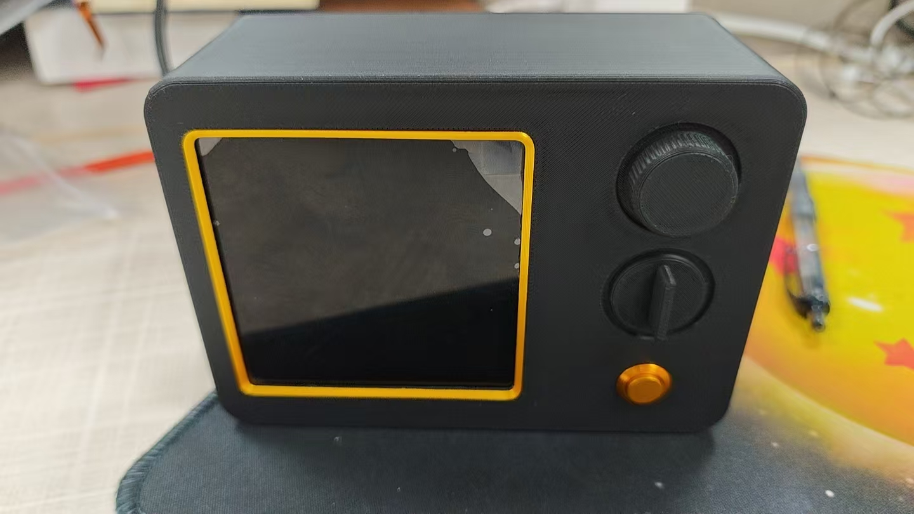
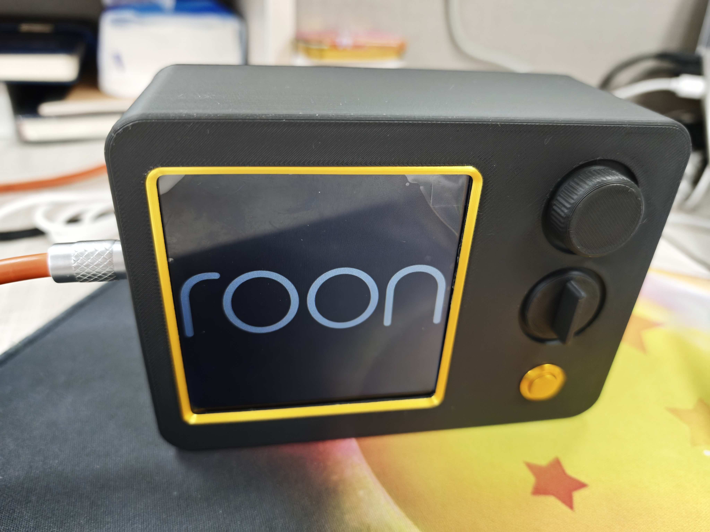
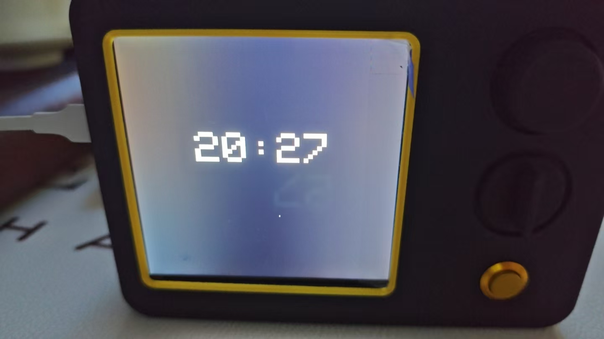
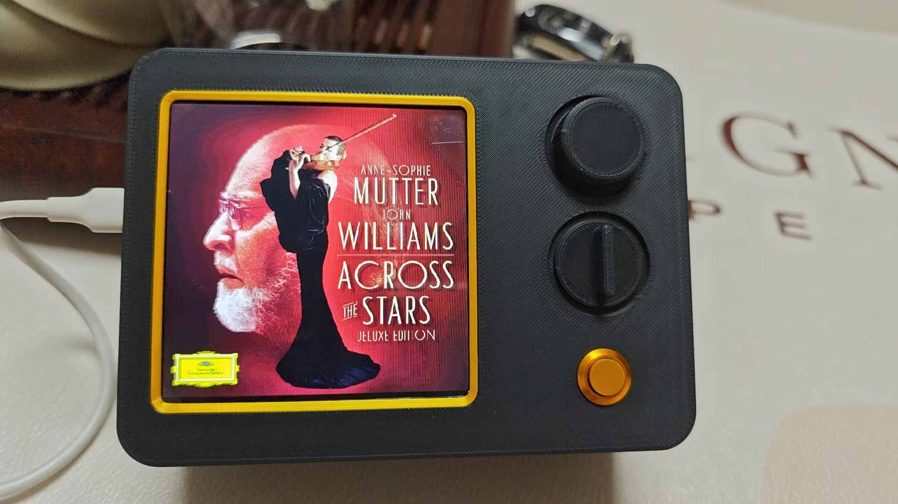
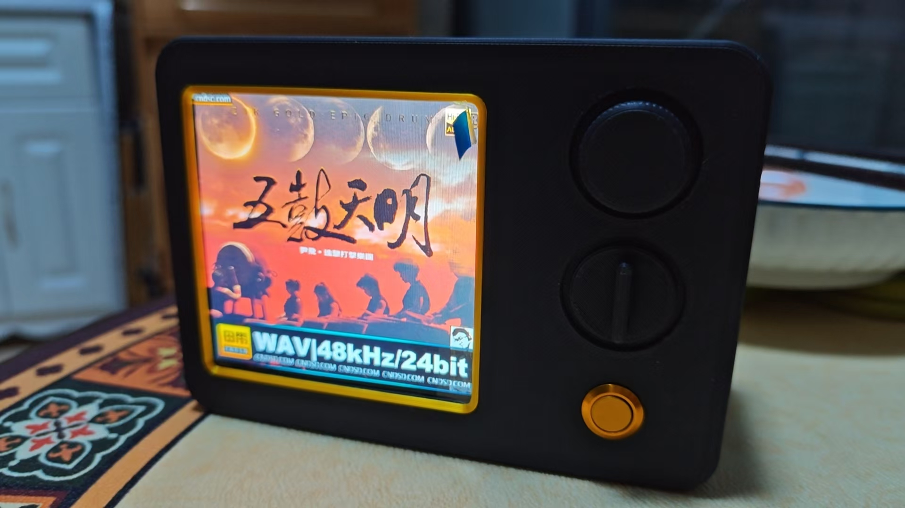

# Roon Cover Display — ROON 桌面专辑封面显示器

基于微雪 ESP32-S3-Touch-LCD-4 (V4 非触摸版) 的 Roon 专辑封面桌面小摆件。连接局域网内的 RoonCoverArt 服务器，在 480×480 屏幕上实时显示当前播放曲目的专辑封面，**空闲时自动切换为 NTP 时钟**。

## 效果
- 外观


- Logo


- 时钟


- 显示1



- 显示2


- 上电 → 启动画面 "roon logo" → 自动连接 WiFi → 连接 Roon 服务器 → 全屏显示封面
- **切歌 1-3s 内显示新封面**
- **停止播放 15s 后自动切换为时钟**（大号 HH:MM ）
- 任何曲目开始播放立即返回全屏封面
- 服务器离线/断网自动重连

## 硬件

| 项目 | 参数 |
|------|------|
| 开发板 | 微雪 ESP32-S3-Touch-LCD-4 **V4 非触摸版** |
| 处理器 | ESP32-S3-N16R8, 双核 240MHz |
| 屏幕 | 4 寸 TFT, 480×480, ST7701 驱动 (RGB 并行接口) |
| 存储 | 16MB Flash + 8MB PSRAM |
| 连接 | WiFi 2.4GHz |

> ⚠️ 开发板 wiki：https://www.waveshare.net/wiki/ESP32-S3-Touch-LCD-4

## 依赖服务

需要局域网内有 [RoonCoverArt](https://github.com/epochaudio/RoonCoverArt_Square_Frame_Docker)服务器运行（需要 `/api/status` + `/roonapi/getImage` 接口）。

## 快速开始

### 1. 安装 Arduino 库

Arduino IDE → 工具 → 管理库，搜索安装：

- **LovyanGFX** (by lovyan03) — 显示驱动
- **ArduinoJson** (v7.x) — JSON 解析
- **U8g2** (by olikraus) — CJK 字体引擎
- **U8g2_for_Adafruit_GFX** — U8g2 与 LovyanGFX 的适配层

### 2. Arduino IDE 配置

```
工具 → 开发板 → ESP32S3 Dev Module
工具 → PSRAM → Enable / OPI PSRAM
工具 → USB CDC On Boot → Enabled
工具 → Partition Scheme → Huge APP (3MB NO OTA/1MB SPIFFS)
```

### 3. 修改配置

将 `wifi_config.example.h` 复制为 `wifi_config.h`，填入网络信息：

```cpp
const char* WIFI_SSID     = "你的WiFi名";
const char* WIFI_PASS     = "你的WiFi密码";
const char* SERVER_HOST   = "X.X.X.X";   // RoonCoverArt 服务器的 IP
const int   SERVER_PORT   = 3666;        // RoonCoverArt 端口
```

### 4. 上传

编译上传到开发板即可。

## 工作原理

```
上电
  ↓
初始化 TCA9554 (I2C: GPIO15/GPIO7, addr=0x24)
  ↓
初始化 ST7701 显示屏 (3-wire SPI + RGB 并行)
  ↓
初始化 U8g2 + 启动 NTP 同步 (异步)
  ↓
显示启动画面 "roon display"
  ↓
WiFi 连接
  ↓
若 WiFi 失败: 显示 "WiFi FAIL" 3s 后自动重启 (fix #2)
  ↓
进入 STATE_RETRY 状态 (5s 节流), 反复重试直到拉到首张封面
  ↓
首次拉 /api/status -> 同步下载初始封面 -> 显示
  ↓
进入 loop() 主循环 (每帧 < 250ms):
  ├─ COVER 状态: tickDownload() 非阻塞推进 (4KB chunk read, fix #4)
  │              poll /api/status -> 歌名/image_key 变化即 abort 旧 + startDownload 新
  │              空闲 15s -> CLOCK 状态 (需首次 poll 完成, fix #7)
  └─ CLOCK 状态: 每秒 showClock() (内部分钟节流)
                  NTP 未同步时显示 "NTP syncing..." 提示 (fix #6)
                  poll /api/status -> is_playing -> COVER 状态
  └─ WiFi/Roon 中途掉线: 自动回 STATE_RETRY, 不变砖 (fix #3)
```

## 项目结构

```
ESP32-roon-display/
├── RoonCoverDisplay.ino    # 主程序 (入口, Arduino IDE 直接打开)
├── boot_logo.h             # 启动画面 JPG 数据 (PROGMEM)
├── wifi_config.example.h   # 凭据模板 (复制为 wifi_config.h)
├── pinout.md               # V4 引脚映射
├── README.md               # 本文件
├── display/                # 实景照片 (README 引用)
├── docs/                   # 进阶文档
│   ├── pinout.md           # 与根目录 pinout.md 同步
│   └── troubleshooting.md  # 故障排查
└── main/                   # ESP-IDF 项目骨架 (SquareLine Studio 导出, 备用方案)
```

---

## 更新历史

### v0.2.1 — 2025-XX-XX · 关键 Bug 修复版

本次更新针对代码 review 中发现的多处稳定性 / 正确性问题做了修复，**强烈建议升级**。

#### 🐛 修复的 Bug

| # | 问题 | 影响 | 修复 |
|---|------|------|------|
| 1 | `pollStatus()` 中 `info.album = String(t)` 错把歌名当作专辑名写入 `/roonapi/getImage` 的 `albumName=` 参数 | 服务器经常返回错专辑封面或 fallback 到默认图 | 改为 `String(a)` 正确读取 `three_line.line3` |
| 2 | `setup()` 中 WiFi 失败没有显式处理，会静默进入后续流程 | WiFi 密码错时无任何提示，看起来像设备卡死 | 加 `ensureWiFi()`，失败时显示 "WiFi FAIL" 3 秒后 `ESP.restart()` |
| 3 | `setup()` 中 `while (true) delay(1000)` 一旦进入**只能断电重启** | 服务器临时关闭、配置错误、首次启动慢 → 设备变砖 | 引入 `STATE_RETRY` 状态机，节流重试，loop 接管，永不变砖 |
| 4 | `tickDownload()` 用 `read()` 逐字节读网络流 | 一张 800KB 封面要 5-15 秒才能下完，远超"1-3s 切歌"目标 | 改用 `readBytes(buf, 4096)` 4KB chunk 读，速度提升 5-10× |
| 5 | `abortDownload()` 没有 `dlStream->stop()` | 频繁切歌几十次后 WiFi socket 文件描述符耗尽 | 在 `delete HTTPClient` 前先 `dlStream->stop()` |
| 6 | `showClock()` 在 NTP 未同步时直接 `return`，屏幕保持黑屏 | 设备冷启动后 5-30 秒内屏幕全黑，可能被误判为屏幕损坏 | 显示 "NTP syncing..." 提示，证明设备存活 |
| 7 | `setup()` 中 `lastPlayingSeenMs = millis()` 在 Roon 探测阶段被赋值 | 首次启动播放前就会触发"空闲 15s 切到时钟" | 新增 `firstPollDone` 标志，第一次 poll 后才开始计时 |
| 11 | `pollStatus()` 每次循环都 `new HTTPClient` | 高频调用下 socket 创建/销毁累积 | 改为 `static HTTPClient http` + URL cache 复用 |
| 12 | `buildImageUrl()` 没 `reserve()` 容量 | 频繁切歌产生堆碎片 | 提前 `reserve(160+key+album)` |

#### ✨ 新增 / 改进

- **`STATE_RETRY` 状态机**：设备启动失败或运行中 WiFi/Roon 掉线时，进入节流重试 (5s)，恢复后自动继续。**设备从此不再变砖。**
- **`ensureWiFi()` 工具函数**：抽离 WiFi 连接逻辑，setup() 和 loop() 共用，含 15s 软超时 + `yield()` 不饿死看门狗。
- **首次重试即时触发**：`lastRetryMs = 0` 让 loop() 第一次进入 RETRY 时立即尝试，不需要等满 5 秒。

#### ⚠️ 行为变化（用户可见）

1. **WiFi 密码错误**：现在会看到 "WiFi FAIL" 红字 3 秒然后自动重启（之前是静默卡死）
2. **Roon 服务器临时关闭**：现在屏幕会显示 "Roon..." 黄字，每 5 秒重试，恢复后自动继续（之前是直接卡死）
3. **NTP 未同步时进时钟模式**：现在显示 "NTP syncing..." 提示（之前是黑屏）
4. **首次启动更慢一点点**：loop() 重试机制比原来同步等待稍微慢 5 秒左右（仅 WiFi/服务器首次不可达时）

#### 🔬 升级方法

只需替换 `RoonCoverDisplay.ino` 一个文件即可，`boot_logo.h` / `pinout.md` / `wifi_config.example.h` 等均无变化。重新编译上传即可享受所有修复。

#### 📋 验证场景

升级后建议测试以下场景：

- [ ] 正常播放 → 切歌应明显更流畅（切歌时间从 5-15s 降至 1-3s）
- [ ] 拔掉 Roon 服务器网线 → 屏幕应显示 "Roon..."，恢复后自动继续（**不再变砖**）
- [ ] 故意把 `wifi_config.h` 密码改错 → 屏幕显示 "WiFi FAIL" 3 秒后自动重启
- [ ] NTP 屏蔽状态下进时钟模式 → 显示 "NTP syncing..." 而不是黑屏
- [ ] 频繁切歌几十首 → 不再因 socket 耗尽而无法下载新封面

#### 🙏 致谢

本次 review 与修复由 [DeepSeek](https://deepseek.com) 协助完成。如果你也想给你的 ESP32 项目做一次免费 code review，欢迎交流。
